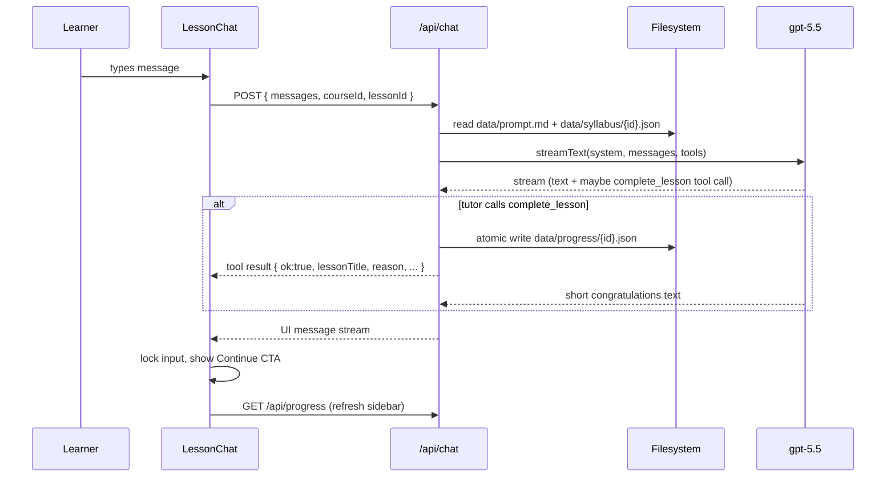

# Fellowship Tutor

> **One-on-one AI learning experience** — guides a learner through a structured course with Socratic tutoring, measurable lesson outcomes, and explicit progress controls.

## Why it stands out

- **Mastery before progression:** the tutor advances a learner only after the current lesson outcomes are demonstrated.
- **Clear product control:** lesson completion is a validated tool action, not an unguarded model-side state change.
- **Editable course design:** course content and tutoring behavior live in simple local files, making the learning experience easy to adapt.
- **Modern delivery:** a streaming Next.js interface with an AI SDK-powered tutoring loop and a responsive progress sidebar.


A focused, one-on-one AI tutor that walks a learner through a course one lesson at a time. The tutor is patient, Socratic, and refuses to advance until every mastery outcome for the current lesson has been demonstrated. Progress is stored on disk — there is no database.

## Quick start

```bash
cp .env.example .env.local
# add your OpenAI API key to .env.local

pnpm install
pnpm dev
```

Then open <http://localhost:3000>.

## Architecture



### Folders

```
app/
  api/
    chat/route.ts            # streamText + complete_lesson tool — the entire tutor loop
    progress/route.ts        # GET current progress for the sidebar
  page.tsx                   # server component, loads course + progress and mounts <TutorShell>
  layout.tsx, globals.css    # fonts, theme tokens, brand color, animations
components/
  tutor-shell.tsx            # sidebar + chat layout, active lesson state
  sidebar.tsx                # course title, progress, lesson rows (locked / current / completed)
  lesson-chat.tsx            # useChat + AI Elements, completion card, locked-input state
  ai-elements/, ui/          # AI Elements + shadcn primitives
lib/
  syllabus.ts                # load and look up course/lesson JSON
  progress.ts                # read + atomic write of progress JSON
  prompt.ts                  # build the system prompt — re-read from disk every turn
data/
  prompt.md                  # editable tutor system prompt (hot-read; no restart)
  syllabus/PY101.json        # course definition (id, title, lessons, outcomes)
  progress/PY101.json        # { completedLessonIds, updatedAt } — gitignored
```

The whole tutor lives in three files: `app/api/chat/route.ts`, `components/lesson-chat.tsx`, and `data/prompt.md`. Most behaviour changes happen in the prompt.

## Authoring content

### Adding a new course

Drop a JSON file into `data/syllabus/`:

```json
{
  "id": "MY101",
  "title": "My Course",
  "description": "A short blurb shown under the title in the sidebar.",
  "lessons": [
    {
      "id": "my101-01-foo",
      "title": "Lesson one",
      "outcomes": [
        "Outcome the learner must demonstrate before moving on",
        "Another outcome"
      ]
    }
  ]
}
```

Then change the `DEFAULT_COURSE_ID` constant in [`app/page.tsx`](app/page.tsx) (or build a picker — listing `data/syllabus/` is straightforward).

### Editing the tutor's behaviour

Open [`data/prompt.md`](data/prompt.md), edit, save. The next learner turn picks it up — no restart, no page reload. The file uses three placeholders that the server fills in each turn:

- `{{courseTitle}}` — from the syllabus
- `{{lessonTitle}}` — current lesson
- `{{lessonOutcomes}}` — numbered list of the current lesson's outcomes

## The `complete_lesson` tool

The tutor has exactly one tool. Its contract (see [`app/api/chat/route.ts`](app/api/chat/route.ts)):

```ts
complete_lesson({
  lessonId: string,  // must equal the active lesson id
  reason: string,    // one sentence shown to the learner in the celebration card
})
```

When the model calls it:

1. The server validates that `lessonId` matches the active lesson, then writes `data/progress/{courseId}.json` via a temp-file-and-rename to avoid partial writes.
2. The tool result `{ ok, lessonTitle, reason, completedLessonIds }` streams back to the client.
3. `LessonChat` notices the `output-available` tool part, locks the input, shows a celebration card with the model's `reason`, and offers a **Continue** button for the next lesson.
4. The sidebar re-fetches `/api/progress` and updates the row states.

The guardrails for *when* to call it live in [`data/prompt.md`](data/prompt.md), so you can tune them without touching code.

## Tech stack

- **[Next.js 16](https://nextjs.org)** (App Router, Turbopack) — server components for SSR of the syllabus + filesystem-backed APIs
- **[AI SDK 6](https://ai-sdk.dev)** — `streamText`, `tool`, `convertToModelMessages`, `toUIMessageStreamResponse`, `useChat`
- **[@ai-sdk/openai](https://www.npmjs.com/package/@ai-sdk/openai)** + **`gpt-5.5`** as the tutor model
- **[AI Elements](https://elements.ai-sdk.dev)** — `Conversation`, `Message`, `MessageResponse`, `PromptInput`, `Suggestion`
- **[shadcn/ui](https://ui.shadcn.com)** + **[Tailwind v4](https://tailwindcss.com)** — design primitives and theme tokens
- **[Zod v4](https://zod.dev)** — tool input schemas
- **[lucide-react](https://lucide.dev)** — icons

## Deploying

The `complete_lesson` tool writes to the local filesystem in `data/progress/`. This works on any long-lived host:

- Fly.io, Render, Railway, a plain VM, Docker — fine, mount a volume at `./data` so progress survives restarts.
- **Vercel serverless: not directly supported.** Each invocation gets a fresh, read-only filesystem. To deploy there, swap `lib/progress.ts` for a small KV/Postgres adapter (the interface — `readProgress`, `markComplete`, `currentLessonId` — is the only thing that needs to change).

`data/prompt.md` and `data/syllabus/*.json` are committed; treat them as configuration that ships with the app.
